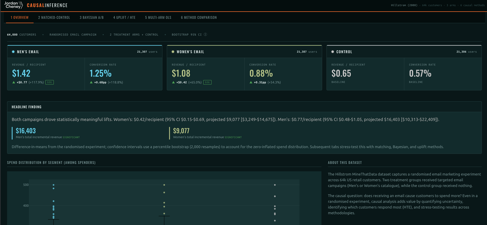

# Causal Inference Dashboard

An interactive portfolio-grade causal inference dashboard built with Dash in Python.
Applies a number of causal methods to a publicly available retail email marketing dataset (Hillstrom, 2008),
allowing side-by-side comparison of estimates, uncertainty and assumptions.

---

## Screenshot



---

## Methods Covered

| Tab | Method | Library |
|-----|--------|---------|
| 2 | **Propensity Score Matching (PSM)** | scikit-learn |
| 3 | **Bayesian A/B Test** | PyMC, ArviZ |
| 4 | **Uplift Modelling / HTE** (T-Learner, S-Learner) | scikit-uplift |
| 5 | **Multi-Arm OLS with Interactions** | statsmodels |

---

## Dataset

The [MineThatData Email Analytics dataset](https://blog.minethatdata.com/2008/03/minethatdata-e-mail-analytics-and-data.html)
(Hillstrom, 2008) captures a randomised marketing experiment across 64,000 US retail customers:

- **Men's Email** arm: 21,388 customers
- **Women's Email** arm: 21,307 customers
- **Control (No Email)**: 21,305 customers
- **Outcome**: spend ($) in the two weeks after the campaign
- **Covariates**: recency, purchase history, gender catalogue, zip code, newbie status, channel

---

## To Add

- Further feature engineering


## How to Run Locally

### 1. Install dependencies

```bash
python -m venv .venv
source .venv/bin/activate   # Windows: .venv\Scripts\activate
pip install -r requirements.txt
```

### 2. Run the app

```bash
python app.py
```

Open your browser at **http://localhost:8050**.

> **First run**: The app will pre-compute all causal models (~3–5 minutes for PyMC
> sampling + PSM bootstrap + uplift models) and cache results to `.cache/results.pkl`.
> Subsequent starts load instantly from cache.

### 3. Force recompute

If you want to force a recompute, delete the cache directory and restart:

```bash
rm -rf .cache && python app.py
```

---

## What This Demonstrates

### Methodological breadth
Selecting and applying the *right* method for the causal question: ATE via PSM and OLS,
posterior distributions via Bayesian inference, and individual-level CATE via uplift modelling.

### Uncertainty quantification
Every estimate is accompanied by an appropriate confidence interval: bootstrap CIs for PSM,
HDI for Bayesian, and coefficient CIs for OLS.

### Individual-level causal thinking
Uplift modelling moves beyond average effects to identify *which customers* respond most,
enabling targeted campaign optimisation.

### Assumption transparency
Every tab includes a collapsible "Methodology & Assumptions" section written for both
technical and non-technical audiences.

---

## Project Structure

```
.
├── app.py            # Dash app layout + callbacks
├── causal_utils.py   # All causal estimation logic (PSM, Bayesian, Uplift, OLS)
├── requirements.txt
├── README.md
└── .cache/
    └── results.pkl   # Auto-generated on first run
```
